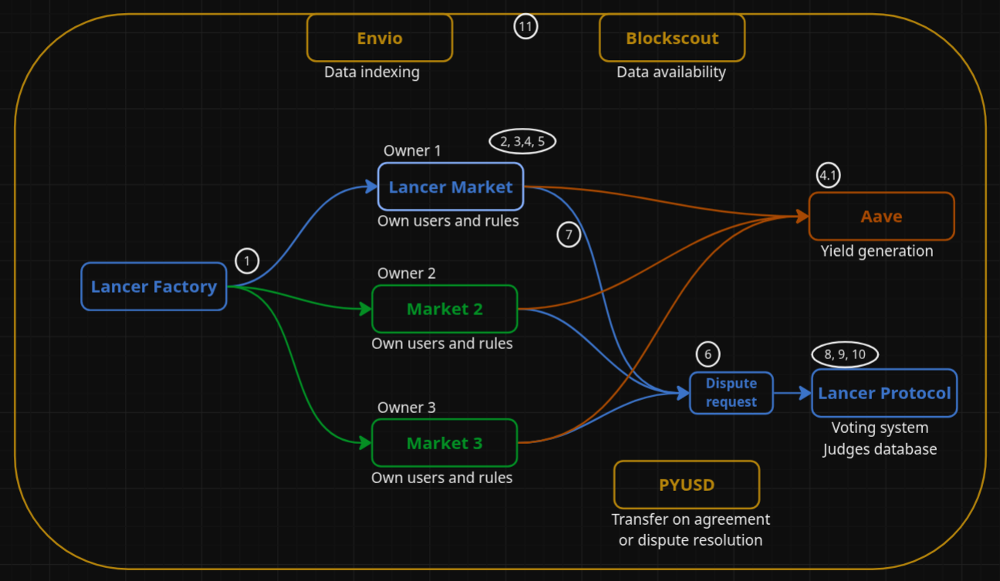

🌐 An open-source protocol that allows anyone to create and deploy their own marketplaces on the Ethereum blockchain in a few seconds.

## Problem we focus on
Centralized marketplace platforms charge high fees, in case of cross-border payments they can be delayed for several days and have an average cost of 6.04%. Additionally, they rely on dispute processes centralized in the same platforms.

## Solution

**Lancer** provides the infrastructure for decentralized marketplaces and payment applications, by allowing anyone to deploy their own marketplaces, with secure escrow mechanisms and on-chain dispute resolution. While obtaining:
- **Lower Fees**: Marketplace owners can offer reduced fees because locked funds generate yield through lending protocols, providing an automatic extra income.
- **Fast Payments**: Users can withdraw instantly to their wallets, avoiding conversion costs and cross-border bank delays.
- **Free Payments**: Transfers through Ethereum have zero extra costs even in case of cross-border payments.
- **Trustless Escrow**: Smart contracts lock funds, releasing only on verified conditions.
- **Transparency**: The entire system is open-source and immutable while all transactions are public on Blockscout.
- **Honesty**: In case of disagreement, users can request a dispute resolution, which based on games' theory incentivaze jusged to for being honest.
  
------------------------------

## How It Works



1. Anyone, lets say `Creator`, can deploy a marketplace through `Lancer Factory`
2. Users register on the marketplace as either `Payers` (the ones who pay for services, products, etc.) or `Beneficiaries` (the ones who receive the payments, such as freelancers or sellers).
3. The `Payer` and `Beneficiary` agree on the `Deal` conditions, such as the PYUSD amount, duration, milestones, and metadata.
4. When the Payer accepts, PYUSD tokens are transferred to the marketplace contract. 
4.1. In the same transaction, those tokens are supplied to Aave to generate yield. The yield earnings can only be withdrawn by the Creator or an account designated by them.
5. If the `Payer` considers that the `Deal` conditions have been met, they can finalize it, allowing the `Beneficiary` to withdraw the corresponding PYUSD amount.
5.1. If the agreed duration plus one additional week has passed, the `Beneficiary` automatically becomes eligible to withdraw the corresponding amount.
5.2. A percentage fee is always subtracted from the `Beneficiary’s` final balance. This percentage is defined by the `Creator` and can range between 0 and 100.
6. If the `Payer` believes the conditions were not met, they can request a `Dispute` within the same marketplace. This function transfers a certain amount of PYUSD to the `Lancer Protocol`, depending on how many judges the Payer wants to participate in the case.
7. The `Beneficiary` is notified, and both parties can submit evidence for the judges to evaluate.
8. After a set number of days, the voting process begins. `Judges` are incentivized to vote honestly, since their reputation increases — and they receive PYUSD rewards — only if they vote with the majority. Otherwise, their reputation decreases.
9. Once voting is complete, the `Lancer Protocol` calls the corresponding marketplace contract, indicating which party won the Dispute and can withdraw their PYUSD.
10.  Reputation scores are updated based on the results, for jusges on `Lancer Protocol` and also for `Payer` and `Beneficiary` on the marketplace contract.
11.  During the entire process, `Envio HyperIndex` indexes all on-chain events in real time to power UIs, analytics, and search. Meanwhile, `Blockscout` allows anyone to explore contract source code, transactions, and verify behavior directly from the frontend.

This modular approach is ideal for industries like: Freelance & gig marketplaces, DAO bounty platforms, AI-to-AI or agentic payment flows Peer-to-peer commerce and Web3 escrow-as-a-service infrastructure, between several others.

------------------------------

## ⚡ Sponsor integrations

Lancer integrates cutting-edge technologies from hackathon sponsors to deliver a **secure, transparent, and data-driven escrow marketplace**.  
Each integration enhances a different layer of the system, from payments and transparency to analytics and UX.

### PYUSD
- PYUSD is a US Dollar-backed stablecoin, providing a reliable and widely accepted currency for Web3 payments. Lancer integrates PYUSD as the token for Lancer Protocol and for every marketplace instance.
- More in deep explanation **[link](./sponsors/PYUSD.md)** and **[video](./sponsors/PYUSD.md)** explanation.

### Envio
- Envio provides real-time event indexing and analytics for blockchain applications. Lancer uses Envio HyperIndex to efficiently track escrows, dispute events, and marketplaces activity.
- More in deep explanation **[link](./sponsors/Envio.md)** and **[video](./sponsors/PYUSD.md)** explanation.

### Blockcscout
- Blockscout is an open-source blockchain explorer for Ethereum and EVM-compatible networks. Lancer leverages Blockscout to offer even more transparency, allowing users to verify smart contract interactions and transaction history.
- More in deep explanation **[link](./sponsors/Blockscout.md)** and **[video](./sponsors/PYUSD.md)** explanation.

------------------------------

## ⚙️ Setup

### Requirements

You need to install the following tools:

- [Node (>= v20.18.3)](https://nodejs.org/en/download/)
- Yarn ([v1](https://classic.yarnpkg.com/en/docs/install/) or [v2+](https://yarnpkg.com/getting-started/install))

### Quickstart

To get started follow those steps:

1. Install dependencies:

```
yarn install
```

2. Run a local network in the first terminal:

```
yarn chain
```

This command starts a local Ethereum network using Foundry. You can customize the network configuration in `packages/foundry/foundry.toml`.

3. On a second terminal, deploy the test contract:

```
yarn deploy
```

This command deploys a test smart contract to the local network. If you want to deploy on a real testnet you can execute:

```
forge script script/DeploySepolia.s.sol \
  --rpc-url sepolia \
  --private-key $SEPOLIA_DEPLOYER_KEY \
  --broadcast
```

4. Inside `envio` folder start the server:
   
```
pnpm dev
```

5. To start the frontend run:

```
yarn start
```

Visit the app on: `http://localhost:3000`. You can interact with the smart contracts going to `Lancer App` page.

6. For running smart contract tests use 
   
```
yarn foundry:test
```

7. If the front-end shows some issues you can run:
  
```
yarn add class-variance-authority @radix-ui/react-dialog @radix-ui/react-label tailwind-merge
```

------------------------------

## ✅ Roadmap

### ⚡ **Lancer Protocol**

- [x] Define smart contracts structure and flow
- [x] Implement payment system integrating **PYUSD**
- [x] Deploy smart contracts to testnet (Sepolia and Anvil)  
- [x] Write unit and integrations tests for all the contracts
- [x] Implement an on-chain reputation scoring system based on previous disputes results
- [x] Implement disputes system emitting indexed events for **Envio**
- [x] Verify contracts on **Blockscout** transparency  
- [x] Integrate **Envio HyperIndex** to index Escrow and Dispute events in real time  
- [x] Build a Dispute Dashboard to visualize indexed disputes via **Envio HyperIndex**  
- [x] Implement fee model for protocol sustainability
- [ ] Implement a tier system for judges, based on reputation
- [ ] Develop Lancer Protocol's SDK and APIs
- [ ] Add `CrossChainExecutor` for cross-chain payments  
- [ ] Document ABI interfaces and protocol workflows for developers  
- [ ] Build analytics dashboards using **Envio HyperIndex** for usage metrics  
- [ ] Launch a developer documentation portal with examples and tutorials  
- [ ] Implement a random selection of the judges for the specific dispute
- [ ] Implement private voting mechanism with vote reveal only after conclusion
- [ ] Launch developer documentation portal with tutorials
- [ ] Add protocol upgradeability

### 🛠️ **Lancer Factory**

- [x] Define smart contracts structure and flow 
- [x] Link Factory with Protocol contract
- [x] Add Factory metadata registry (track deployed marketplaces and owners)
- [ ] Deploy marketplace instances deterministically (CREATE2)
- [ ] Enable upgrade mechanism for future marketplace templates

### 🛒 **Lancer Market**

- [x] Deploy **Lancer Market** as an example dApp using Lancer Factory 
- [x] Implement payment system with **PYUSD**
- [x] Integrate wallet connection (MetaMask or RainbowKit) with **PYUSD** payment support  
- [x] Implement basic job posting and hiring flow between `payers` and `beneficiaries`  
- [x] Allow users to create and manage their on-chain escrows through the UI  
- [ ] Implement milestones system for `deals`
- [ ] Build a user dashboard to view active escrows, completed jobs, and earnings  
- [ ] Add real-time notifications for escrow creation, release, and dispute resolution  
- [ ] Allow multiple tokens payments by converting them to **PYUSD** when sended

### 🧱 General
- [x] Develop, test and deploy smart contract
- [x] Develop front-end to interact with **Lancer Factory**, **Lancer Protocol** and deployed marketplaces
- [ ] Write end-to-end integration tests between front-end, backend and contracts
- [ ] Implement gasless meta-transactions for certain actions via relayers
- [ ] Write technical whitepaper explaining Lancer Protocol design & economics
- [ ] Apply to grants and accelerators
- [ ] Launch community documentation site on GitHub Pages
- [ ] Run security audit and formal verification on core contracts
- [ ] Deploy to mainnet (Ethereum / Base / Arbitrum) once fully audited
- [ ] Prepare v2 roadmap (potentially: governance, staking and multi-chain support)